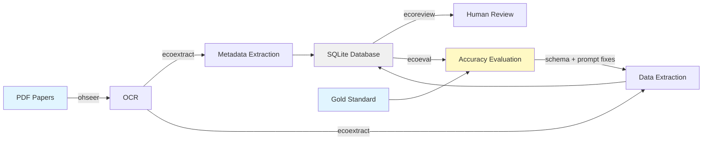

# ecoeval

Measure how accurately an AI extraction pipeline performed against a
human-curated gold standard.

## Pipeline



| Package | Purpose | Links |
| ------- | ------- | ----- |
| [ohseer](https://github.com/n8layman/ohseer) | OCR processing (Mistral, Tensorlake, Claude) | [GitHub](https://github.com/n8layman/ohseer) |
| [ecoextract](https://github.com/n8layman/ecoextract) | AI-powered extraction pipeline | [Docs](https://n8layman.github.io/ecoextract/) \| [GitHub](https://github.com/n8layman/ecoextract) |
| [ecoreview](https://github.com/n8layman/ecoreview) | Interactive Shiny review app | [Docs](https://n8layman.github.io/ecoreview/) \| [GitHub](https://github.com/n8layman/ecoreview) |
| [ecoeval](https://github.com/n8layman/ecoeval) | Accuracy evaluation against a gold standard | [Docs](https://n8layman.github.io/ecoeval/) \| [GitHub](https://github.com/n8layman/ecoeval) |

## The problem it solves

You have two sets of results from the same papers: one the AI produced, one a
person produced by hand. You want to know how well the AI did.

You can't just lay the two tables side by side. People — and AI — often describe
the same thing in different ways: a different spelling, a name written out in
full on one side and shortened on the other, a whole sentence worded differently
but meaning exactly the same. **The rows don't line up on their own, even when
they're describing the same thing.**

So ecoeval works in two steps. First it **pairs up the rows**, matching each AI
row to the human row describing the same thing — using probabilistic record
linkage, fuzzy matching for near-identical text, and an LLM judge where the
wording differs but the meaning may not. Then it **scores the result**:
precision, recall, and field-level accuracy across the whole set.

You don't have to check its work row by row. Press **Resolve all differences**,
read the numbers, done. Going through papers one at a time is for when you want
to see *why* it's getting things wrong.

## Installation

```r
# renv (recommended for renv-managed projects)
renv::install("n8layman/ecoeval")

# pak
pak::pak("n8layman/ecoeval")

# remotes
remotes::install_github("n8layman/ecoeval")
```

## Usage

```r
library(ecoeval)

# Launch and pick inputs in the app
run_eval_app()

# Or supply them up front
run_eval_app(
  ai     = "ecoextract_records.db",
  gold   = "gold_standard.csv",
  schema = "ecoextract/schema.json"
)
```

## Status

Working. The evaluation runs end to end — load, align papers, align records,
score, read the numbers, export the bundle. The LLM rungs (the normalising
comparator and the judge) need an API key; without one the cheap comparator
rungs still run and contested cells are reported as *unjudged* rather than
silently scored wrong.

See [`DESIGN.md`](DESIGN.md) for the full design — including a **Deliberately
out of scope** section recording what was considered and cut, and why.

### Scripting it

The app is a shell over a library. Everything it computes is a plain function
over data frames, so an evaluation can be run without launching anything:

```r
run <- ecoeval::evaluate_extraction(
  ai     = "ecoextract_records.db",
  gold   = "gold_standard.csv",
  schema = "ecoextract/schema.json"
)

ecoeval::aggregate_metrics(run$cells)
ecoeval::field_metrics(run$cells)   # sorted worst first -- the triage order
run$findings                        # grouped schema / model / gold
```

To see it work with no data of your own, press **Use the bundled example** on
the load screen, or point the arguments at the synthetic fixtures in
`inst/extdata/`.

## Requirements

- R >= 4.0
- [ecoextract](https://github.com/n8layman/ecoextract) output, or any record
  table plus the `schema.json` it was extracted against
- An API key for the LLM judge (copy `.env.example` to `.env`)

## License

GPL-3
